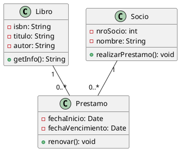
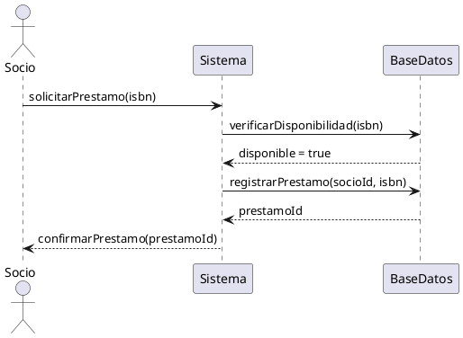

# PRD — Metodología de Sistemas I — TUP 2026

**Autor:** Sergio (Sergiotsk) · Estudiante TUP · Electricista · PC Técnico · Argentina
**Fecha:** Mayo 2026
**Tipo:** materia
**Opción:** B — materia con programa oficial (UTN Haedo · Plan 2024)
**Objetivo final:** Dominar los fundamentos de la Ingeniería de Software, los modelos de ciclo de vida, la ingeniería de requerimientos, la planificación de proyectos y las estrategias de testing para poder analizar, especificar y gestionar proyectos de software en contextos profesionales reales.
**Tiempo disponible:** 30–45 min/día · 3–4 veces por semana
**Duración estimada:** 1 cuatrimestre (abril–julio 2026)
**Agente recomendado:** Claude Code (claude.ai)
**Entorno:** Windows 11 Pro · ASUS ROG Strix · Ryzen 7 · 16GB RAM

**Fuentes verificadas:**
- [x] Programa oficial verificado: UTN Haedo · Metodología de Sistemas I · Plan 2024 (Comisión M3)
- [x] Bibliografía del PRD verificada: Pressman (7° Ed.), Sommerville (9° Ed.), PMBOK (6° Ed.), Kniberg, Sutherland
- [x] Web search habilitado
- [ ] Context7 disponible y activo *(verificar antes de arrancar cada sesión)*

---


## 1. Entorno de trabajo

### Paths del sistema


| Path | Propósito |
|---|---|
| `E:\SERJITO\SB_Sergio\` | Vault de Obsidian — notas, teoría, seguimiento |
| `E:\SERJITO\TUP\TUP-REPO\MetodologiaDeSistemasI\` | Artefactos, diagramas, ejercicios y entregas |

### Criterio: qué va a cada lugar

| Contenido | Dónde va |
|---|---|
| Resumen de un concepto teórico | `SB_Sergio/10-Proyectos/TUP-Materias/Metodologia de sistemas I/teoria/` |
| Apuntes de clase o del libro | `SB_Sergio/10-Proyectos/TUP-Materias/Metodologia de sistemas I/teoria/` |
| Diagrama UML, PERT/CPM, Casos de Uso | `TUP-REPO/MetodologiaDeSistemasI/unidad-XX/` |
| User Stories, Product Backlog, Requerimientos | `TUP-REPO/MetodologiaDeSistemasI/unidad-03/` |
| Casos de prueba y planes de testing | `TUP-REPO/MetodologiaDeSistemasI/unidad-05/` |
| TP o trabajo entregable | `TUP-REPO/MetodologiaDeSistemasI/entregas/` |
| Proyecto final | `TUP-REPO/MetodologiaDeSistemasI/proyecto-final/` |

### Estructura de TUP-REPO para este proyecto

```
E:\SERJITO\TUP\TUP-REPO\MetodologiaDeSistemasI\
    ├── unidad-01\   ← definiciones, taxonomía, atributos de calidad, paradigmas
    ├── unidad-02\   ← ciclos de vida, diagramas, casos de uso UML, DevOps
    ├── unidad-03\   ← user stories, backlog, requerimientos FR/NFR
    ├── unidad-04\   ← PERT/CPM, tablas de decisión, diagramas de clase y secuencia UML
    ├── unidad-05\   ← casos de prueba, scripts de testing, planes QA/QC
    ├── proyecto-final\   ← proyecto integrador de la materia
    └── entregas\    ← TPs y entregas de la materia
```

---

### Herramienta principal: Draw.io (diagrams.net)

Entorno local y web para crear diagramas UML, PERT/CPM y Casos de Uso. Permite exportar como `.drawio` (editable) y `.png` / `.svg` para las entregas.

> **Nota:** Los archivos `.drawio` van en la carpeta de la unidad correspondiente en TUP-REPO. Las capturas/exports para entregas van en `entregas/`.

---

#### Setup de herramientas de diagramación

**Opción A — Online (recomendado para entregas):**
- Abrir [https://app.diagrams.net](https://app.diagrams.net) → conectar a Google Drive o guardar local
- Formato de exportación: `.drawio` + `.png` de alta resolución

**Opción B — VS Code (recomendado para trabajo diario con PlantUML):**
- Instalar extensión: `PlantUML` (ID: `jebbs.plantuml`)
- Instalar extensión: `Draw.io Integration` (ID: `hediet.vscode-drawio`)
- PlantUML requiere Java: instalar JDK 17+ y agregar a PATH

---

#### Uso diario resumido

| Acción | Cómo |
|---|---|
| Crear diagrama de Casos de Uso | Draw.io → plantilla UML → Case Diagram |
| Crear diagrama PERT/CPM | Draw.io → en blanco → formas básicas |
| Crear diagrama de Clases | PlantUML en VS Code → `@startuml ... @enduml` |
| Crear diagrama de Secuencia | PlantUML en VS Code → `@startuml ... @enduml` |
| Exportar para entrega | Draw.io → File → Export → PNG (300 dpi) |

---

## 2. Second Brain en Obsidian


### Estructura de carpetas en el vault

```
E:\SERJITO\SB_Sergio\10-Proyectos\TUP-Materias\Metodologia de sistemas I\
├── 00-Dashboard-MS1.md
├── teoria\
│   ├── 01-fundamentos-ingenieria-software.md
│   ├── 02-paradigmas-modernos-cloud-ia.md
│   ├── 03-ciclos-de-vida-iso12207.md
│   ├── 04-metodologias-agiles-scrum-kanban.md
│   ├── 05-modelado-funcional-casos-de-uso.md
│   ├── 06-devops-cicd.md
│   ├── 07-ingenieria-de-requerimientos.md
│   ├── 08-historias-de-usuario-backlog.md
│   ├── 09-planificacion-pert-cpm-estimacion.md
│   ├── 10-modelado-estatico-dinamico-uml.md
│   └── 11-testing-qa-qc-automatizacion.md
└── seguimiento\
    ├── clase-01.md
    ├── clase-02.md
    └── ... (clase-16.md)
```

### Dashboard 00-Dashboard-MS1.md

```markdown
---
materia: Metodología de Sistemas I
cuatrimestre: 1C-2026
comision: M3
docente-maniana: Ing. Andrea F. Vera
docente-noche: Lic. Mabel SHARPE
estado: en-progreso
---

# Dashboard — Metodología de Sistemas I

## Estado del cuatrimestre
- Fase actual: <!-- COMPLETAR -->
- Clase actual: <!-- COMPLETAR -->
- Próxima entrega: <!-- COMPLETAR -->

## Progreso por fase
- [ ] Fase 1 — Fundamentos + Ciclo de Vida + Metodologías (Clases 1–7)
- [ ] 1° Examen Parcial (Clase 8)
- [ ] Fase 2 — Requerimientos + Planificación + Testing (Clases 9–13)
- [ ] 2° Examen Parcial (Clase 14)
- [ ] Recuperatorio si aplica (Clase 16)

## Notas de teoría
```dataview
TABLE estado FROM "10-Proyectos/TUP-Materias/Metodologia de sistemas I/teoria"
SORT file.name ASC
```

## Seguimiento por clase
```dataview
TABLE estado, objetivo FROM "10-Proyectos/TUP-Materias/Metodologia de sistemas I/seguimiento"
SORT file.name ASC
```
```

### Frontmatter de notas de teoría

```yaml
---
tema: [nombre del tema]
unidad: [número de unidad según el programa]
bibliografía: Pressman Cap. X / Sommerville Cap. X / PMBOK
estado: pendiente
tags: [ms1, metodologia, ingenieria-software, tup]
---
```

### Frontmatter de notas de seguimiento por clase

```yaml
---
clase: [número]
fecha: [YYYY-MM-DD]
fase: [nombre de la fase]
objetivo: [qué se estudia esta clase]
tiempo-real: [minutos/horas efectivos]
estado: pendiente
bloqueos: []
---
```

### Valores válidos de `estado`

| Valor | Cuándo usarlo |
|---|---|
| `pendiente` | Al crear la nota |
| `en-progreso` | Al arrancar esa clase/unidad |
| `completa` | Al terminar |

### Plugins requeridos
- **Dataview** — para las queries del Dashboard
- **Tasks** — para los checkboxes con filtros
- **Kanban** — para vista de tablero
- **Periodic Notes** — para notas de seguimiento automáticas
- **Remotely Save** — sync con Google Drive


---

## 3. Visión general

Metodología de Sistemas I es una materia de nivel 3 de la Tecnicatura Superior en Programación de UTN Haedo. Integra las correlativas de Programación I, Programación II, Organización Empresarial y Base de Datos I, y es correlativa obligatoria de Metodología de Sistemas II.

El eje central es la **Ingeniería de Software como disciplina**: se aprende a analizar el proceso de desarrollo de software de manera sistemática, elegir el modelo de ciclo de vida correcto para cada contexto, relevar y documentar requerimientos con estándares profesionales, planificar proyectos con técnicas como PERT/CPM y Planning Poker, y diseñar estrategias de prueba diferenciando QA de QC.

El aprendizaje se organiza en dos fases que respetan el calendario oficial: la Fase 1 cubre Fundamentos, Ciclos de Vida y Metodologías (hasta el 1° parcial en la Clase 8), y la Fase 2 cubre Requerimientos, Planificación y Testing (hasta el 2° parcial en la Clase 14). La bibliografía principal son Pressman y Sommerville, complementados con PMBOK, Kniberg y Sutherland.


---

## 4. Objetivos medibles

| # | Objetivo | Criterio de éxito |
|---|---|---|
| 1 | Dominar los fundamentos de la Ingeniería de Software: definiciones, taxonomía, paradigmas modernos y gestión de calidad | Poder explicar la diferencia entre software de producto y de proceso, y nombrar los 3 atributos de calidad ISO/IEC 9126 sin consultar apuntes |
| 2 | Comparar modelos de ciclo de vida y elegir el correcto según el contexto del proyecto | Dado un caso, justificar la elección entre Cascada, Espiral, Incremental o Scrum con argumentos técnicos basados en Sommerville Cap. 2 |
| 3 | Especificar requerimientos funcionales y no funcionales con precisión profesional | Entregar un documento de requerimientos con al menos 5 FR y 3 NFR para un caso de estudio dado, sin ambigüedades |
| 4 | Crear user stories válidas bajo criterios INVEST con Product Backlog refinado | Escribir 10 user stories correctas con criterios de aceptación y estimación en Story Points, organizadas en un Product Backlog priorizado |
| 5 | Planificar un proyecto usando PERT/CPM y Story Points | Construir un diagrama PERT/CPM con ruta crítica identificada y holguras calculadas para un proyecto de 8+ actividades |
| 6 | Diseñar casos de prueba y diferenciar QA de QC | Especificar un plan de pruebas con al menos 10 casos de prueba (caja negra y caja blanca) para un módulo de software dado |
| 7 | Aprobar los parciales de la materia | Nota igual o superior a 6 en ambos parciales |


---

## 5. Stack / herramientas / materiales

### Principal
- Draw.io (diagrams.net) — diagramas UML, PERT/CPM, Casos de Uso
- PlantUML + VS Code — diagramas de clases y secuencia en texto plano
- Obsidian — notas de teoría y seguimiento (Vault SB_Sergio)
- Google Docs / Word — documentos de requerimientos, user stories y planes de testing

### Complementario
- Trello o Notion — simulación de Product Backlog y tablero Kanban/Scrum
- GitHub Projects — gestión visual de iteraciones (opcional)
- Microsoft Project o GanttProject (gratuito) — diagramas de Gantt si se requieren en entregas

### Bibliografía / documentación oficial

| Título | Autor | Para qué unidad |
|---|---|---|
| Ingeniería del Software: Un enfoque práctico (7° Ed.) | Pressman, R. S. | Unidades 1, 2, 3, 5 |
| Ingeniería de Software (9° Ed.) | Sommerville, I. | Unidades 1, 2, 3, 4 |
| Guía del PMBOK (6° Ed.) | PMI | Unidad 4 — Gestión de Cronograma |
| Kanban y Scrum: Obteniendo lo mejor de ambos | Kniberg y Skarin | Unidad 2 — Metodologías ágiles |
| Scrum: El arte de hacer el doble de trabajo en la mitad de tiempo | Sutherland, J. | Unidad 2 — Scrum |
| Manual de DevOps | Kim, Humble et al. | Unidad 2 — DevOps |
| Historias de Usuario: Una visión pragmática | Abad y Salazar | Unidad 3 — User Stories |
| Introducción a las Pruebas de Sistemas de Información | Toledo, F. | Unidad 5 — Testing |

### Agente IA para este PRD
- **Agente:** Claude (claude.ai) — modo chat para sesiones de estudio y revisión de artefactos
- **Por qué:** Puede revisar user stories, verificar diagramas UML descritos en texto, explicar conceptos de Pressman/Sommerville y generar variantes de ejercicios de estimación y testing
- **Limitaciones:** No ejecuta diagramas directamente; los artefactos se crean en Draw.io o PlantUML


---

## 6. Fases de aprendizaje

### FASE 1 — Fundamentos, Ciclo de Vida y Metodologías (Clases 1–7)
**Meta:** Comprender qué es la Ingeniería de Software como disciplina, comparar modelos de ciclo de vida, entender las metodologías ágiles (Scrum, Kanban) y el paradigma DevOps, y modelar el alcance de un sistema con diagramas de Casos de Uso.

---

#### Clase 1 — Fundamentos de Ingeniería de Software (Unidad 1.1)

**Teoría de Sistemas y Software**
- Concepto: Definición de sistema, software como producto y proceso. Taxonomía del software. Componentes de un sistema de software. Atributos de calidad (ISO/IEC 9126). Diferencia entre Ingeniería de Software e Informática.
- Práctica: Clasificar 5 sistemas de software reales según la taxonomía de Pressman. Listar atributos de calidad de cada uno.
- 📖 **Leer:** Pressman Cap. 1 — completo
- 🗒️ **Nota Obsidian:** `10-Proyectos/TUP-Materias/Metodologia de sistemas I/teoria/01-fundamentos-ingenieria-software.md`
- 💾 **Guardar en:** `TUP-REPO/MetodologiaDeSistemasI/unidad-01/taxonomia-software.md`

#### Clase 2 — Paradigmas Modernos (Unidad 1.2 y 1.3)

**Computación en la nube, Microservicios e IA aplicada al desarrollo**
- Concepto: Modelos de cloud computing (IaaS, PaaS, SaaS). Arquitecturas de Microservicios vs. Monolíticas. Programación asistida por IA. Introducción a modelos de madurez (CMM/CMMI) y estándares de calidad.
- Práctica: Mapear un sistema conocido (ej. Netflix, Mercado Libre) a los conceptos IaaS/PaaS/SaaS y microservicios. Justificar por escrito.
- 📖 **Leer:** Pressman Cap. 2 — secciones sobre paradigmas modernos
- 🗒️ **Nota Obsidian:** `10-Proyectos/TUP-Materias/Metodologia de sistemas I/teoria/02-paradigmas-modernos-cloud-ia.md`
- 💾 **Guardar en:** `TUP-REPO/MetodologiaDeSistemasI/unidad-01/paradigmas-modernos.md`

---

#### Clase 3 — Modelos de Ciclo de Vida (Unidad 2.1 y 2.2)

**ISO/IEC 12207 y comparativa Cascada vs. Ágil**
- Concepto: Estándar ISO/IEC 12207 — procesos primarios, de soporte y organizacionales. Modelo en Cascada (Waterfall): fases, ventajas, limitaciones. Modelos evolutivos e incrementales (Espiral, Incremental). Cuándo usar cada uno.
- Práctica: Construir una tabla comparativa de modelos de ciclo de vida con criterios: riesgo, flexibilidad, comunicación con el cliente, tamaño del equipo.
- 📖 **Leer:** Sommerville Cap. 2 — "El proceso del software"
- 🗒️ **Nota Obsidian:** `10-Proyectos/TUP-Materias/Metodologia de sistemas I/teoria/03-ciclos-de-vida-iso12207.md`
- 💾 **Guardar en:** `TUP-REPO/MetodologiaDeSistemasI/unidad-02/comparativa-ciclos-vida.md`

#### Clase 4 — Metodologías Ágiles: Scrum y Kanban (Unidad 2.4)

**Frameworks adaptativos**
- Concepto: Manifiesto Ágil — 4 valores y 12 principios. Scrum: roles (Product Owner, Scrum Master, Dev Team), artefactos (Product Backlog, Sprint Backlog, Incremento), eventos (Sprint, Daily, Review, Retrospective). Kanban: columnas, límites WIP, flujo continuo. Diferencias entre Scrum y Kanban.
- Práctica: Diseñar un tablero Kanban en Trello para el cursado de MS1. Definir columnas y límites WIP.
- 📖 **Leer:** Sommerville Cap. 3 — "Desarrollo ágil de software" · Kniberg — "Kanban y Scrum" caps. 1–3
- 🗒️ **Nota Obsidian:** `10-Proyectos/TUP-Materias/Metodologia de sistemas I/teoria/04-metodologias-agiles-scrum-kanban.md`
- 💾 **Guardar en:** `TUP-REPO/MetodologiaDeSistemasI/unidad-02/scrum-kanban-comparativa.md`

#### Clase 5 — Modelado Funcional: Casos de Uso UML (Unidad 2.5)

**Especificación del alcance con Diagramas de Casos de Uso**
- Concepto: Diagramas de Casos de Uso UML — actores, casos de uso, relaciones (include, extend, generalización). Especificación textual de un caso de uso (flujo principal, flujos alternativos, precondiciones, postcondiciones). Diferencia entre UC diagram y descripción de UC.
- Práctica: Modelar el sistema de inscripción a materias de UTN con un diagrama de Casos de Uso en Draw.io. Describir textualmente 2 casos de uso.
- 📖 **Leer:** Sommerville Cap. 5.1 — "Modelos de requerimientos de sistemas"
- 🗒️ **Nota Obsidian:** `10-Proyectos/TUP-Materias/Metodologia de sistemas I/teoria/05-modelado-funcional-casos-de-uso.md`
- 💾 **Guardar en:** `TUP-REPO/MetodologiaDeSistemasI/unidad-02/diagrama-casos-uso.drawio`

#### Clase 6 — Cultura DevOps: CI/CD y Automatización (Unidad 2.3)

**Integración Continua y Entrega Continua**
- Concepto: Cultura DevOps — romper silos entre Dev y Ops. Pipeline CI/CD: etapas (build, test, deploy). Herramientas principales (GitHub Actions, Jenkins, GitLab CI). Relación entre DevOps, Scrum y metodologías ágiles.
- Práctica: Describir un pipeline CI/CD básico para un proyecto web. Identificar qué pruebas se automatizarían en cada etapa.
- 📖 **Leer:** Manual de DevOps — Kim, Humble et al. — caps. introductorios
- 🗒️ **Nota Obsidian:** `10-Proyectos/TUP-Materias/Metodologia de sistemas I/teoria/06-devops-cicd.md`
- 💾 **Guardar en:** `TUP-REPO/MetodologiaDeSistemasI/unidad-02/devops-pipeline.md`

#### Clase 7 — Repaso Unidades 1 y 2 (pre-parcial)

**Repaso general y resolución de dudas**
- Concepto: Repaso integral de Unidades 1 y 2. Resolución de ejercicios tipo parcial.
- Práctica: Resolver 5 preguntas tipo parcial sobre los temas cubiertos. Auto-evaluar con la tabla de criterios.
- 📖 **Leer:** Todo lo anterior — Pressman Caps. 1–2 · Sommerville Caps. 2, 3, 5.1
- 🗒️ **Nota Obsidian:** actualizar `00-Dashboard-MS1.md` con estado actual
- 💾 **Guardar en:** `TUP-REPO/MetodologiaDeSistemasI/entregas/repaso-parcial-1.md`

---

#### Clase 8 — 1° Examen Parcial

> Cubre todo el contenido de las Clases 1 al 7 (Unidades 1 y 2 completas).

---

### FASE 2 — Requerimientos, Planificación y Testing (Clases 9–13)
**Meta:** Relevar y documentar requerimientos funcionales y no funcionales con precisión, gestionar un Product Backlog con User Stories bajo INVEST, planificar un proyecto con PERT/CPM y Story Points, modelar con UML y diseñar estrategias de prueba diferenciando QA de QC.

---

#### Clase 9 — Ingeniería de Requerimientos (Unidad 3.1 y 3.2)

**OKRs, requerimientos funcionales y no funcionales**
- Concepto: Diferencia entre requerimiento funcional (qué hace el sistema) y no funcional (atributos de calidad: performance, seguridad, usabilidad). Técnicas de elicitación: entrevistas, observación, prototipado. Objetivos y Resultados Clave (OKRs) como alineación técnico-estratégica. Documentación de requerimientos: SRS (Software Requirements Specification).
- Práctica: Para un caso de estudio dado por la cátedra, listar 5 FR y 3 NFR correctamente especificados.
- 📖 **Leer:** Pressman Cap. 7 — "Principios y conceptos de análisis"
- 🗒️ **Nota Obsidian:** `10-Proyectos/TUP-Materias/Metodologia de sistemas I/teoria/07-ingenieria-de-requerimientos.md`
- 💾 **Guardar en:** `TUP-REPO/MetodologiaDeSistemasI/unidad-03/requerimientos-fr-nfr.md`

#### Clase 10 — Documentación Ágil: Historias de Usuario y Backlog (Unidad 3.3 y 3.4)

**User Stories bajo INVEST y gestión del Product Backlog**
- Concepto: Historia de Usuario — formato "Como [rol], quiero [acción], para [beneficio]". Criterios INVEST (Independent, Negotiable, Valuable, Estimable, Small, Testable). Criterios de aceptación (Gherkin: Given-When-Then). Product Backlog: priorización (MoSCoW, valor vs. esfuerzo). Planning Poker para estimación. Sprint Backlog. Épicas vs. User Stories.
- Práctica: Escribir 10 user stories para un sistema de gestión de turnos médicos. Estimar en Story Points (Fibonacci). Organizar en un Product Backlog priorizado.
- 📖 **Leer:** Pressman Cap. 5 — "Comprensión de los requisitos" · Abad y Salazar — "Historias de Usuario" caps. 1–3
- 🗒️ **Nota Obsidian:** `10-Proyectos/TUP-Materias/Metodologia de sistemas I/teoria/08-historias-de-usuario-backlog.md`
- 💾 **Guardar en:** `TUP-REPO/MetodologiaDeSistemasI/unidad-03/user-stories-backlog.md`

#### Clase 11 — Planificación y Gestión de Tiempos (Unidad 4.1, 4.2 y 4.3)

**Tablas/Árboles de Decisión y PERT/CPM**
- Concepto: Tablas de decisión — condiciones, acciones, combinaciones. Árboles de decisión — nodos de decisión, nodos de azar. PERT/CPM: red de actividades, duración optimista/pesimista/más probable, ES/EF/LS/LF, ruta crítica, holgura total y libre. Planning Poker y estimación por analogía.
- Práctica: Construir un diagrama PERT/CPM en Draw.io para un proyecto de 10 actividades. Calcular la ruta crítica y las holguras a mano.
- 📖 **Leer:** PMBOK — "Gestión del Cronograma del Proyecto" (Cap. 6)
- 🗒️ **Nota Obsidian:** `10-Proyectos/TUP-Materias/Metodologia de sistemas I/teoria/09-planificacion-pert-cpm-estimacion.md`
- 💾 **Guardar en:** `TUP-REPO/MetodologiaDeSistemasI/unidad-04/pert-cpm.drawio`

#### Clase 12 — Modelado Estático y Dinámico UML (Unidad 4.4)

**Diagramas de Clases y de Secuencia**
- Concepto: Diagrama de Clases — clases, atributos, métodos, relaciones (asociación, agregación, composición, herencia, dependencia). Multiplicidad. Diagrama de Secuencia — objetos, mensajes síncronos/asíncronos, líneas de vida, frames (loop, alt, opt). Cuándo usar cada uno.
- Práctica: Modelar en PlantUML un diagrama de clases para un sistema de biblioteca (Libro, Socio, Préstamo). Crear el diagrama de secuencia del flujo "realizar préstamo".
- 📖 **Leer:** Sommerville Cap. 5.2 y 5.3 — "Modelos de sistemas"
- 🗒️ **Nota Obsidian:** `10-Proyectos/TUP-Materias/Metodologia de sistemas I/teoria/10-modelado-estatico-dinamico-uml.md`
- 💾 **Guardar en:** `TUP-REPO/MetodologiaDeSistemasI/unidad-04/diagrama-clases.puml` y `diagrama-secuencia.puml`

#### Clase 13 — Testing, Calidad y Automatización (Unidad 5)

**QA vs. QC, diseño de casos de prueba y automatización**
- Concepto: Diferencia entre QA (proceso) y QC (producto). Niveles de testing (unitario, integración, sistema, aceptación). Tipos (caja negra, caja blanca). Partición de equivalencia, análisis de valores límite. Diseño de casos de prueba: ID, descripción, precondiciones, datos de entrada, resultado esperado, resultado actual. Pruebas de regresión. Introducción a la automatización (scripts básicos).
- Práctica: Para el sistema de biblioteca del Clase 12, diseñar un plan de pruebas con al menos 10 casos de prueba (5 caja negra + 5 caja blanca).
- 📖 **Leer:** Pressman Cap. 17 — "Estrategias de prueba del software" · Toledo — "Introducción a las Pruebas de Sistemas de Información" caps. 1–4
- 🗒️ **Nota Obsidian:** `10-Proyectos/TUP-Materias/Metodologia de sistemas I/teoria/11-testing-qa-qc-automatizacion.md`
- 💾 **Guardar en:** `TUP-REPO/MetodologiaDeSistemasI/unidad-05/plan-pruebas.md`

---

#### Clase 14 — 2° Examen Parcial

> Cubre todo el contenido de las Clases 9 al 13 (Unidades 3, 4 y 5 completas).

---

#### Clases 15 y 16 — Notificaciones, Recuperatorio y Cierre

> - Clase 15: Devolución de calificaciones del 2° parcial. Repaso pre-recuperatorio.
> - Clase 16: Examen Recuperatorio (integra todos los contenidos). Notificación de calificaciones finales.


---

## 7. Recursos de aprendizaje

| Recurso | URL / Referencia | Para qué fase |
|---|---|---|
| Pressman — Ing. del Software (7° Ed.) | Bibliografía física / PDF | Fases 1 y 2 |
| Sommerville — Ing. de Software (9° Ed.) | Bibliografía física / PDF | Fases 1 y 2 |
| PMBOK (6° Ed.) | Bibliografía digital | Fase 2 — Clase 11 |
| Kniberg — Kanban y Scrum | Bibliografía digital | Fase 1 — Clase 4 |
| Sutherland — Scrum | Bibliografía digital | Fase 1 — Clase 4 |
| Toledo — Pruebas de Sistemas | Bibliografía digital | Fase 2 — Clase 13 |
| Abad y Salazar — Historias de Usuario | Bibliografía digital | Fase 2 — Clase 10 |
| Draw.io (diagramas online) | https://app.diagrams.net | Clases 5, 11, 12 |
| PlantUML (diagramas en texto) | https://plantuml.com | Clase 12 |
| ISO/IEC 12207 | Bibliografía digital | Fase 1 — Clase 3 |


---

## 8. Archivos de referencia

### Template: Historia de Usuario

```markdown
## Historia de Usuario — [ID]

**Título:** [nombre corto]
**Como:** [rol del usuario]
**Quiero:** [acción que desea realizar]
**Para:** [beneficio que obtiene]

**Criterios de aceptación:**
- **Given** [contexto/precondición]
  **When** [acción del usuario]
  **Then** [resultado esperado]

**Story Points:** [1 / 2 / 3 / 5 / 8 / 13]
**Prioridad:** [Alta / Media / Baja]
**Sprint:** [número de sprint]
```

### Template: Especificación de Caso de Uso

```markdown
## Caso de Uso — [Nombre]

**Actor principal:** [quién inicia la acción]
**Actores secundarios:** [quién participa]
**Precondiciones:** [qué debe ser verdad antes]
**Postcondiciones:** [qué es verdad después]

**Flujo principal:**
1. El actor hace X
2. El sistema responde Y
3. ...

**Flujos alternativos:**
- 2a. Si X no es válido → el sistema muestra error Z

**Excepciones:**
- 2b. Si el sistema no está disponible → mostrar mensaje de error
```

### Template: Caso de Prueba

```markdown
## Caso de Prueba — [ID]

| Campo | Valor |
|---|---|
| **ID** | CP-001 |
| **Módulo** | [nombre del módulo] |
| **Tipo** | Caja Negra / Caja Blanca |
| **Descripción** | [qué se prueba] |
| **Precondiciones** | [estado inicial del sistema] |
| **Datos de entrada** | [valores exactos] |
| **Resultado esperado** | [qué debe ocurrir] |
| **Resultado real** | [completar al ejecutar] |
| **Estado** | Pendiente / Pasó / Falló |
```

### Template: PlantUML — Diagrama de Clases



### Template: PlantUML — Diagrama de Secuencia



---

## 9. Criterios de finalización

- [ ] Tener todas las notas de teoría creadas en Obsidian (notas 01 al 11)
- [ ] Completar la tabla comparativa de ciclos de vida (Clase 3)
- [ ] Crear el diagrama de Casos de Uso en Draw.io (Clase 5)
- [ ] Escribir y priorizar un Product Backlog de 10 user stories (Clase 10)
- [ ] Construir un diagrama PERT/CPM con ruta crítica calculada (Clase 11)
- [ ] Crear diagramas de Clases y Secuencia en PlantUML (Clase 12)
- [ ] Entregar un plan de pruebas con 10 casos de prueba (Clase 13)
- [ ] Aprobar el primer parcial con nota ≥ 6
- [ ] Aprobar el segundo parcial o final con nota ≥ 6


---

## 10. Flujo de sesión diaria

```
[ 5 min ]   Apertura
[ 25–35 min ] Trabajo principal
[ 5 min ]   Cierre
```

### Apertura
1. Abrir `00-Dashboard-MS1.md` — ver qué está `en-progreso` o `pendiente`
2. Abrir nota de seguimiento de la clase actual
3. Definir **un solo objetivo** para esta sesión
4. Cambiar estado a `en-progreso` si corresponde

### Trabajo principal
- **Teoría:** leer capítulo del bibliografía asignada → completar nota en Obsidian
- **Práctica:** crear el artefacto correspondiente (diagrama, user story, caso de prueba) → guardar en TUP-REPO
- **Mixto:** 15 min teoría del libro + 15 min artefacto práctico

> **Regla:** si en 10 min no avanzás por un bloqueo, anotarlo en "Bloqueos y dudas" y seguir con lo próximo.

### Cierre
1. Registrar en seguimiento: qué hiciste + tiempo real
2. Cambiar `estado` a `completa` si terminaste
3. Guardar los artefactos en TUP-REPO/MetodologiaDeSistemasI
4. Anotar objetivo de la próxima sesión

### Instrucciones para el agente IA

Cuando el usuario diga **"arrancamos sesión"** o similar:
```
1. Preguntar en qué clase/unidad está
2. Mostrar el objetivo pendiente más próximo según este PRD
3. Proponer trabajo concreto de esta sesión (teoría, artefacto específico o mixto)
4. Indicar qué capítulo de qué libro debe leer
5. Esperar confirmación antes de arrancar
```

Cuando el usuario diga **"cerramos sesión"** o similar:
```
1. Preguntar qué se hizo y cuánto tiempo tomó
2. Preguntar si hay bloqueos o dudas para registrar
3. Proponer objetivo de la próxima sesión según el PRD
```


---

## 11. Control de alucinaciones — Fuentes y herramientas

### Regla base
> **Si no podés verificarlo con una fuente de la lista permitida, no lo escribas. Indicá explícitamente que necesitás verificarlo.**

### Fuentes válidas para este PRD (tipo: materia)

| Tipo de contenido | Fuente permitida | Fuente prohibida |
|---|---|---|
| Conceptos de Ingeniería de Software | Pressman (7° Ed.) + Sommerville (9° Ed.) | Blogs, Medium, tutoriales de terceros, memoria del modelo |
| Metodologías ágiles (Scrum, Kanban) | Kniberg, Sutherland + documentación oficial Scrum.org | Resúmenes de terceros sin citar |
| Gestión de proyectos y PERT/CPM | PMBOK (6° Ed.) + Gido y Clements | Tutoriales de YouTube sin fuente académica |
| User Stories | Abad y Salazar + Cohn (Agile Estimating) | Plantillas de internet sin criterios INVEST |
| Testing y QA/QC | Toledo (Pruebas de Sistemas) + Pressman Cap. 17 | Recetas de testing genéricas sin fuente |
| Estructura del programa | Programa oficial UTN Haedo MS1 · Comisión M3 | Programas de otras universidades o años |
| Estándares | ISO/IEC 12207 (texto oficial) | Resúmenes de Wikipedia |

### Protocolo antihallucinación por acción

| Acción del agente | Protocolo |
|---|---|
| Explicar un concepto de Ingeniería de Software | Citar el capítulo de Pressman o Sommerville antes de explicar |
| Revisar una user story | Verificar criterios INVEST uno por uno; indicar cuál falla y por qué |
| Validar un diagrama UML | Comparar contra la notación oficial UML 2.x; indicar la fuente |
| Revisar un caso de prueba | Verificar que tenga todos los campos del template; indicar omisiones |
| Generar un ejemplo de artefacto | Indicar que es ejemplo generado, no del material oficial de la cátedra |

### Señales de alerta para el usuario

Si el agente dice alguna de estas frases **sin citar Pressman, Sommerville, PMBOK u otra fuente verificada**, detenerlo y pedir verificación:
- *"Generalmente en metodologías ágiles..."*
- *"Típicamente en Scrum..."*
- *"Creo que la definición es..."*
- *"Debería funcionar así..."*
- *"En la mayoría de los proyectos..."*

---

*PRD generado por Claude (claude.ai) · Mayo 2026*
*Basado en: Programa oficial UTN Haedo Metodología de Sistemas I · Comisión M3 · Plan 2024*
*Docentes: Ing. Andrea F. Vera (mañana) · Lic. Mabel SHARPE (noche)*
*Compatible con: Claude · Claude Code · Cursor · cualquier agente con acceso a archivos*
