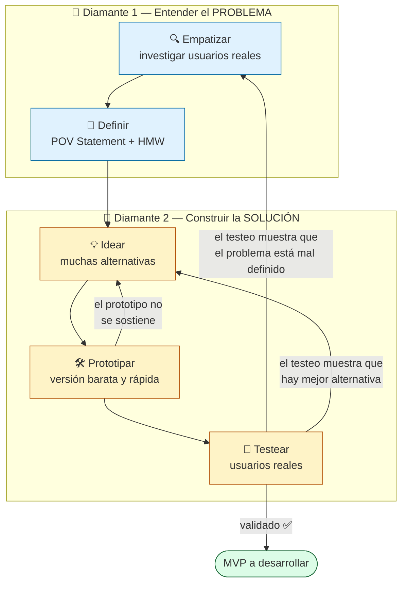

# Design Thinking — Guía teórica y diagrama de fases

**Objetivo de este documento**: repaso conceptual de la metodología Design Thinking, exigida por la profesora para este TP Final. Sirve como base común de equipo antes de retomar (o reformular) las propuestas existentes en `Ideas/`.

**Diagnóstico previo (por qué este documento hace falta)**: las 4 propuestas armadas hasta ahora (`Ideas/01.md` a `04.md`) arrancan directo en "Problema → Solución MVP → Stack tecnológico", sin pasar por un proceso formal de investigación, definición del problema, ideación divergente, prototipado ni testeo con usuarios reales. Eso no es Design Thinking — es intuir un problema y saltar directo a construir. Este documento es el repaso para no repetir ese error.

---

## 1. ¿Qué es Design Thinking?

Design Thinking es una metodología de resolución de problemas **centrada en las personas** (human-centered), popularizada por IDEO y la Stanford d.school. No es una teoría de diseño gráfico ni un framework de gestión de proyectos — es un proceso para atacar **problemas complejos y ambiguos** ("wicked problems") donde no está claro de entrada ni cuál es el problema real, ni cuál es la solución correcta.

Tres ideas centrales que la diferencian de "pensar una solución y programarla":

1. **Empieza por las personas, no por la tecnología ni por la idea.** No se pregunta "¿qué puedo construir?" sino "¿qué necesita de verdad esta persona, y por qué?".
2. **Es iterativo, no lineal.** No se hace una vez y se pasa a la siguiente fase para siempre — se vuelve atrás todas las veces que haga falta cuando la evidencia lo pide.
3. **Tolera la ambigüedad al principio para reducir el riesgo al final.** Se invierte tiempo en entender el problema ANTES de comprometerse con una solución, precisamente para no gastar semanas de desarrollo en algo que nadie necesita.

---

## 2. Las 5 fases

### 2.1 Empatizar (Empathize)

**Objetivo**: entender el problema desde la perspectiva real de la persona que lo sufre, no desde lo que uno supone que le pasa.

**Preguntas guía**: ¿Quién es realmente el usuario? ¿Qué hace hoy para resolver esto (aunque sea a mano, con Excel o WhatsApp)? ¿Qué le genera frustración, pérdida de tiempo o plata? ¿Qué dice vs. qué hace en realidad (esto casi nunca coincide)?

**Herramientas típicas**: entrevistas semiestructuradas con usuarios reales, observación directa (shadowing), mapas de empatía (qué piensa, dice, hace, siente), encuestas exploratorias.

**Error común (presente en las 4 propuestas actuales)**: reemplazar la entrevista real por la propia intuición o experiencia personal como si fuera dato validado. La experiencia propia (como en la Propuesta 04) es un buen disparador, pero no reemplaza confirmar el problema con OTROS actores reales del mismo contexto.

### 2.2 Definir (Define)

**Objetivo**: sintetizar lo investigado en un enunciado de problema claro y accionable — no una lista de síntomas, sino UN problema central bien delimitado.

**Herramienta clave — POV Statement (Point of View)**:
> [Usuario específico] necesita [una manera de resolver X] porque [insight/motivación real descubierta al empatizar].

**Herramienta complementaria — How Might We (HMW)**:
Reformular el POV como pregunta abierta que invite a idear: *"¿Cómo podríamos ayudar a [usuario] a [lograr X] sin [restricción real]?"*

**Error común**: confundir "definir el problema" con "definir la solución". Si en esta fase ya estás pensando en el stack tecnológico, te salteaste el paso.

### 2.3 Idear (Ideate)

**Objetivo**: generar la MAYOR cantidad posible de alternativas de solución antes de elegir una. Divergir primero, converger después.

**Herramientas típicas**: brainstorming clásico (sin juzgar ideas en el momento), Crazy 8's (8 ideas en 8 minutos), Worst Possible Idea (para destrabar creatividad), votación grupal ponderada para converger recién al final.

**Error común (presente en las 4 propuestas actuales)**: llegar directo con UNA sola solución ya definida ("Motor de pricing dinámico", "Módulo de IA de categorización") sin haber comparado contra otras alternativas para el mismo problema. Elegir la primera idea que se te ocurre no es idear, es apostar.

### 2.4 Prototipar (Prototype)

**Objetivo**: construir la versión MÁS BARATA y MÁS RÁPIDA posible de la idea para poder mostrarla y recibir feedback — no para que funcione, sino para que se pueda evaluar.

**Herramientas típicas**: wireframes en papel o Figma, maquetas de baja fidelidad, mockups clicables, incluso un flujo simulado ("Mago de Oz": el usuario cree que interactúa con un sistema automatizado, pero atrás hay una persona resolviendo a mano).

**Error común**: confundir "prototipo" con "MVP funcional en producción". El prototipo de Design Thinking es descartable — su única función es generar aprendizaje barato antes de programar en serio.

### 2.5 Testear (Test)

**Objetivo**: poner el prototipo frente a usuarios reales (idealmente los mismos entrevistados en Empatizar) y observar qué pasa — no preguntarles si les gusta, sino ver si lo usan bien, dónde se traban, qué no entienden.

**Herramientas típicas**: tests de usabilidad guiados, feedback estructurado, métricas simples de si logran completar la tarea.

**Resultado esperado**: el testeo casi siempre revela que hay que volver a una fase anterior. Eso NO es un fracaso del proceso — es el proceso funcionando como corresponde.

---

## 3. No es lineal — es iterativo (esto es lo que más se ignora)

El error más común es tratar las 5 fases como un checklist secuencial que se hace una vez. En la práctica real:

- Si al **Testear** descubrís que el problema estaba mal definido, volvés a **Empatizar**.
- Si al **Prototipar** te das cuenta de que hay una idea mejor, volvés a **Idear**.
- El proceso completo se recorre **varias veces**, cada vez con más información y menos incertidumbre.

Esto se conoce como el modelo del **doble diamante** (double diamond): primero se DIVERGE para entender el problema en toda su amplitud (Empatizar), después se CONVERGE en un problema puntual (Definir); luego se DIVERGE de nuevo para explorar soluciones (Idear), y se CONVERGE en una solución concreta a testear (Prototipar + Testear).

---

## 4. Diagrama de fases

---

## 5. Aplicado a este TP — qué le falta a cada propuesta existente

| Propuesta | Empatizar | Definir | Idear | Prototipar | Testear |
|---|---|---|---|---|---|
| 01 — Hub Airbnb | ❌ sin entrevistas a anfitriones reales | ❌ va directo a features | ❌ una sola solución (pricing + chat) | ❌ no hay | ❌ no hay |
| 02 — Vaquita IA | ❌ sin entrevistas a usuarios de finanzas grupales | ❌ va directo a features | ❌ una sola solución | ❌ no hay | ❌ no hay |
| 03 — Postulación honesta | ❌ sin entrevistas a buscadores de empleo reales | ⚠️ hay un POV implícito pero no documentado como tal | ❌ una sola solución | ❌ no hay | ❌ no hay |
| 04 — Gestión de obra | ⚠️ experiencia propia real, pero falta validar con OTROS actores (gremios, capataces) | ⚠️ el más cercano a un problema bien delimitado | ❌ una sola solución (CPM + forecasting) | ❌ no hay | ❌ no hay |

**Ninguna de las 4 pasó por un proceso formal de Design Thinking.** Todas nacieron de intuición/experiencia y saltaron directo a arquitectura y stack. No están "mal" como ideas de producto — pero como TRABAJO PRÁCTICO que pide explícitamente aplicar esta metodología, hoy no cumplen la consigna.

---

## 6. Cómo seguir desde acá — próximos pasos concretos

1. **No descartar las 4 ideas** — son buen material de partida. Pero antes de re-presentarlas, hay que pasarlas (o elegir 1-2) por el proceso real:
2. **Empatizar de verdad**: conseguir 3-5 entrevistas reales por problemática candidata (anfitriones reales, capataces reales, gente buscando laburo, etc.). Documentar con mapa de empatía.
3. **Definir**: escribir un POV Statement y un HMW por problemática, basado en lo que salió de las entrevistas — no en lo que ya se había asumido.
4. **Idear**: hacer una sesión de brainstorming grupal con al menos 10-15 ideas por problema antes de elegir. Recién ahí converger.
5. **Prototipar**: wireframes de baja fidelidad (Figma/papel) de la idea elegida, ANTES de tocar código de producción.
6. **Testear**: mostrar el prototipo a 2-3 personas del público real y ajustar según lo que digan/hagan.

Recién después de este ciclo, retomar el stack técnico y la arquitectura — esa parte de las propuestas actuales (arquitectura hexagonal, NestJS, Supabase, etc.) sigue siendo válida como pensamiento técnico, simplemente hay que asegurarse de que resuelve el problema YA VALIDADO, no el supuesto inicial.

---

## 7. Herramientas sugeridas para documentar el proceso

| Fase | Herramienta sugerida |
|---|---|
| Empatizar | Google Forms / Meet grabado + plantilla de mapa de empatía (Miro, FigJam, o incluso una tabla en Markdown) |
| Definir | Documento simple con POV + HMW por problemática |
| Idear | Sesión sincrónica en Miro/FigJam o incluso post-its físicos fotografiados |
| Prototipar | Figma (wireframes), o mockups en papel fotografiados |
| Testear | Notas de observación estructuradas: qué logró hacer el usuario, dónde se trabó, qué dijo sin que se le preguntara |

---

*Próximo paso sugerido: elegir con el grupo 1-2 problemáticas candidatas de las 4 ya exploradas (o una nueva) y arrancar formalmente por la fase de Empatizar, documentando las entrevistas antes de tocar una sola línea de propuesta técnica.*
